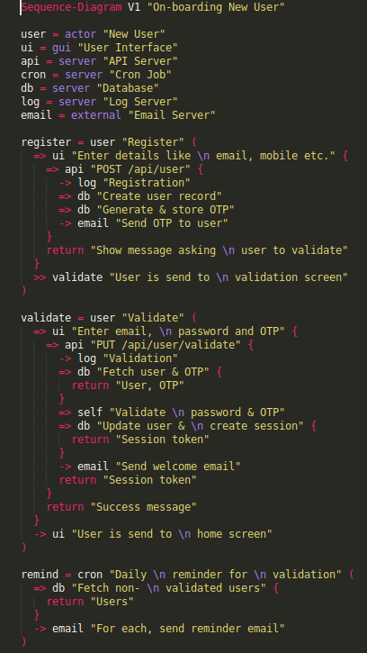
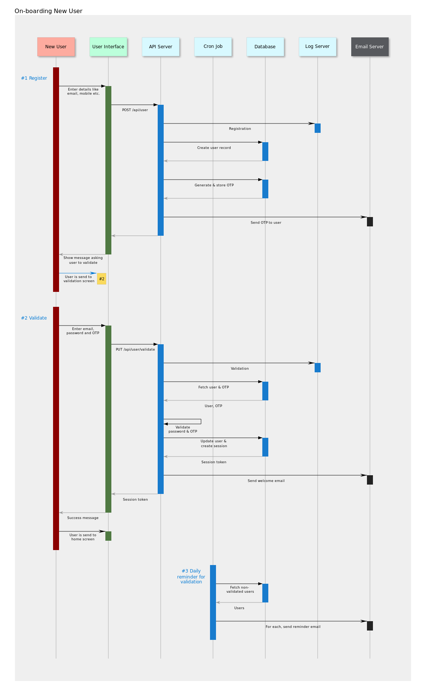
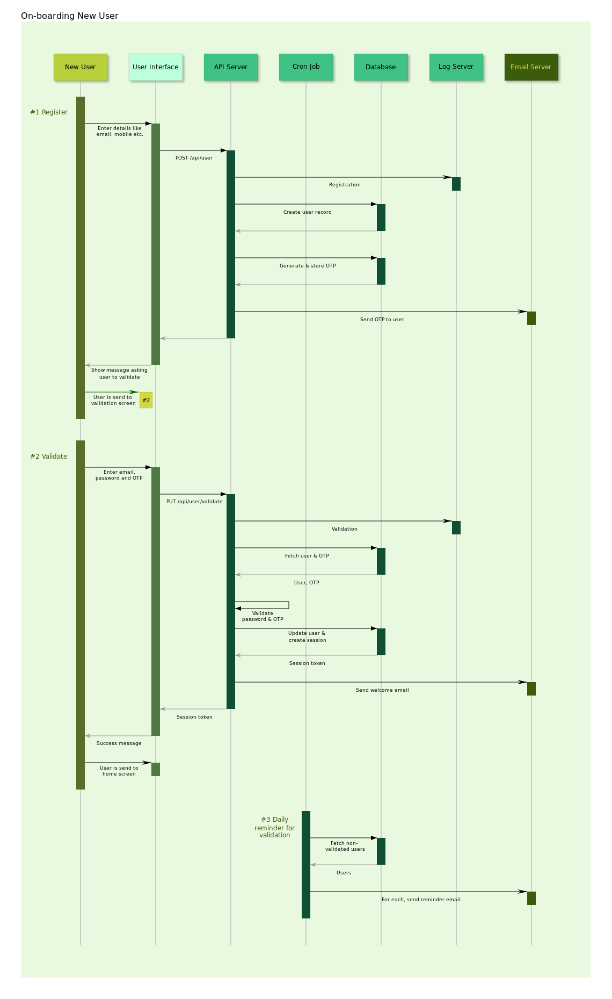

# documan

Utility to generate documents and diagrams.

Currently, it can be used to generate sequence diagrams using a DSL as shown below:

### Input

### Output

Colors can be customized using a json configuration file:

#### Disclaimer
* I am a Clojure newbie, so the implementation is far from ideal; I will keep updating as I learn more of Clojure. 

* Currently, there are no tests.

---

### Installation

Clojure 1.8, Java 12 and Leiningen 2.8.1 are required.

### Usage

The source files (**.documan**) need to be created in src folder. For details, please check the sample projects. 

Sublime syntax-highlighting file is included.

The colors can be customized for each project using a config.json file. Please check the sample projects for details.

    $ lein run <project-path> -t -g

### Options

* Option **-t** will transpile the .documan files in src folder into .edn files in edn folder.

* Option **-g** will generate the documents in dst folder from the .edn files in edn folder.

### Examples

    $ lein run projects/sample-1
    $ lein run projects/sample-2

---
### Syntax

First line needs to be the type of the document and title.
Syntax of fist line:
    
    Sequence-Diagram V<version> "<title>"

Where, title can contain spaces and quotes, preceding and trailing spaces will be trimmed.

Strings can be split to multilines by embedding \n inside them.

    "Line 1 \n Line 2"

For each line preceding and trailing spaces will be trimmed.

Objects are defined in the same order they need to be rendered.
They need to declared at the beginning, before the flows.

    <id> = <tag> "<name>"
   
Where, id needs to be unique. name can contain spaces and quotes, preceding and trailing spaces will be trimmed. tag can be one of the following: **actor**, **gui**, **server** or **external**

Syntax of flow:

    <id> = <object-id> "<name>" (
        <flow-items>
    )

Syntax of flow items:

Call with return:

    => <object-id> "<name>" {
        <flow-items>
        return "<return-value>"	
    }

Call without return:
    
    => <object-id> | self "<name>"

Message:

    -> <object-id> "<name>"

Async call to another flow:

    >> <flow-id> "<name>"

---

### Libraries Used

* **dali** https://github.com/stathissideris/dali is used for generating SVG files.
* **data.json** https://github.com/clojure/data.json is used to read config.json file.

### License

Copyright © 2020 Manoj Kumar A

Distributed under the Eclipse Public License either version 1.0 or (at
your option) any later version.
